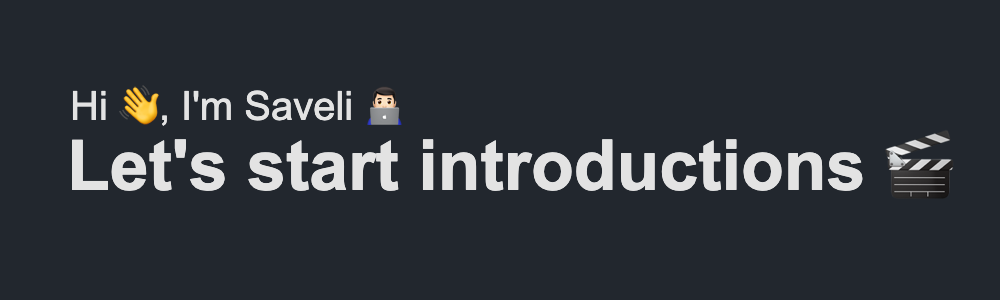

 
# 👨🏻‍💻 **About me:**
I'm a fullstack developer with experience in web development, building RESTful APIs and working with databases. 
My passion is to build beautiful, efficient and user-friendly applications. I am actively developing in my direction studying new technologies and trying to participate in the development of open source projects.

# 🛠 **Technical Toolkit:**
- My working technology stack is **MERN** (MongoDB, ExpressJS, ReactJS and NodeJS)
- Experienced in **cross-browser** and **responsive** development, development using **SSR**, **CSR**, **SSG**
- Deploy applications using **Linux**, **Docker**, **Nginx**

    
    
    
    
    
    

    
    
    
    
    
    
    

    
    
    

# 📈 **Statistics:**

# 🔗 **Contacts:**

    
        

# 🤪 Random Meme

    

    

x

